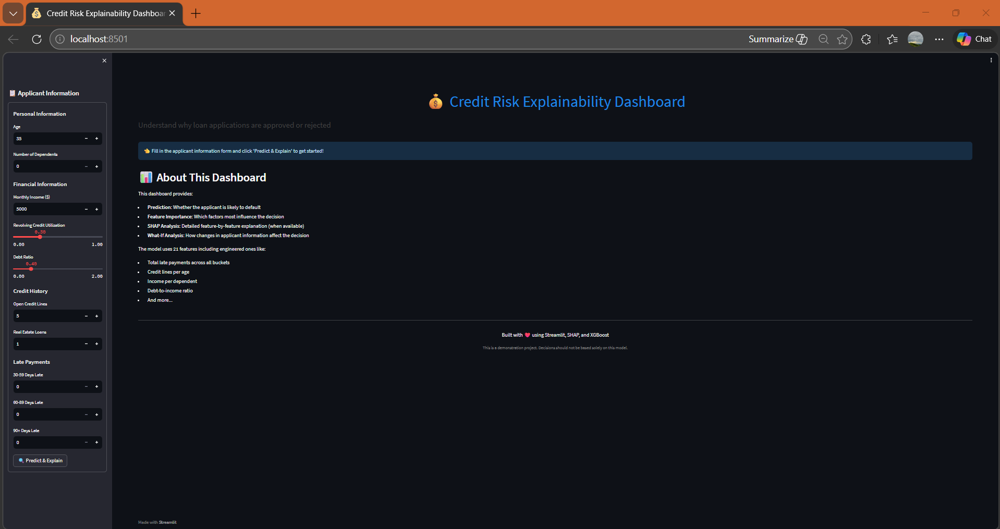
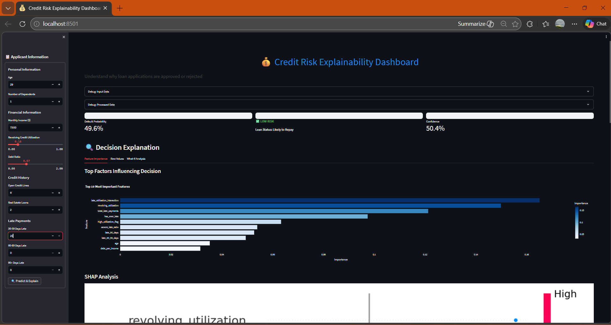

# Explainable Credit Risk Model

[](https://www.python.org/downloads/)
[](https://streamlit.io/)
[](https://xgboost.readthedocs.io/)
[](https://shap.readthedocs.io/)

An end-to-end machine learning project that predicts loan default risk with explainable AI (XAI) techniques. The project includes model comparison, fairness analysis, and an interactive Streamlit dashboard.





## 🎯 Features

- **Multiple Models**: Logistic Regression, Random Forest, and XGBoost
- **Model Explainability**: SHAP and LIME for decision explanations
- **Fairness Analysis**: Demographic parity, equal opportunity, and predictive parity metrics
- **Interactive Dashboard**: Streamlit app for real-time predictions and what-if analysis
- **Comprehensive Evaluation**: ROC-AUC, cross-validation, and feature importance

## 📊 Dataset

[Give Me Some Credit](https://www.kaggle.com/c/GiveMeSomeCredit/data) from Kaggle
- 150,000 borrowers
- 10 features including age, income, credit history
- Binary target: experienced financial distress in next 2 years

## 🛠️ Tech Stack

- **Python** 3.9+
- **Data Processing**: Pandas, NumPy
- **Machine Learning**: Scikit-learn, XGBoost
- **Explainability**: SHAP, LIME
- **Visualization**: Matplotlib, Seaborn, Plotly
- **Web App**: Streamlit
- **Model Persistence**: Joblib

## 🚀 Quick Start

### Prerequisites
- Python 3.9 or higher
- Git

### Installation

1. Clone the repository
```bash
git clone https://github.com/yourusername/explainable-credit-risk.git
cd explainable-credit-risk
```

2. Create virtual environment
```bash
python -m venv venv
source venv/bin/activate  # On Windows: venv\Scripts\activate
```

3. Install dependencies
```bash
pip install -r requirements.txt
```

4. Download the dataset
- Go to Kaggle Competition
- Download cs-training.csv and place it in the data/ folder

5. Run the project
```bash
chmod +x run.sh  # On Mac/Linux
./run.sh  # On Windows: run.bat
```

## 📁 Project Structure

```bash
explainable-credit-risk/
├── data/                   # Dataset files
├── notebooks/              # Jupyter notebooks for EDA
├── src/                    # Source code
│   ├── data_preprocessing.py
│   ├── model_training.py
│   ├── model_explainability.py
│   ├── fairness_analysis.py
│   └── main.py
├── models/                 # Saved models
├── outputs/                # Plots and reports
├── app.py                  # Streamlit dashboard
├── requirements.txt        # Dependencies
└── README.md              # This file
```

## 📈 Results

### Model Performance
- XGBoost: ROC-AUC 0.87
- Random Forest: ROC-AUC 0.85
- Logistic Regression: ROC-AUC 0.78

### Key Insights
- Late payment history is the strongest predictor of default
- Income and debt ratio show non-linear relationships
- Model shows slight bias towards younger applicants

## 🔍 Explainability Features
### SHAP Analysis
- Global feature importance
- Local explanations for individual predictions
- Force plots showing decision factors
### LIME Comparison
- Local interpretable models
- Feature contribution weights
- Comparison with SHAP explanations

## ⚖️ Fairness Analysis
The project evaluates model fairness across:

- Age groups (<30 vs >30)
- Income levels (below/above median)
- Dependents (0-2 vs 3+)

Metrics calculated:
- Demographic Parity Ratio
- Equal Opportunity Difference
- Predictive Parity Ratio

## 🎨 Streamlit Dashboard
The interactive dashboard allows:
1. Input Form: Enter applicant information
2. Real-time Prediction: Get instant risk assessment
3. SHAP Explanation: Understand feature contributions
4. What-If Analysis: Test different scenarios
5. Fairness Metrics: View bias analysis

## 📝 License
This project is licensed under the MIT License.

## 🙏 Acknowledgments
- Kaggle for the "Give Me Some Credit" dataset
- SHAP and LIME developers for explainability tools
- Streamlit for the amazing web framework

## 🤝 Contributing
Contributions are welcome! Please feel free to submit a Pull Request.